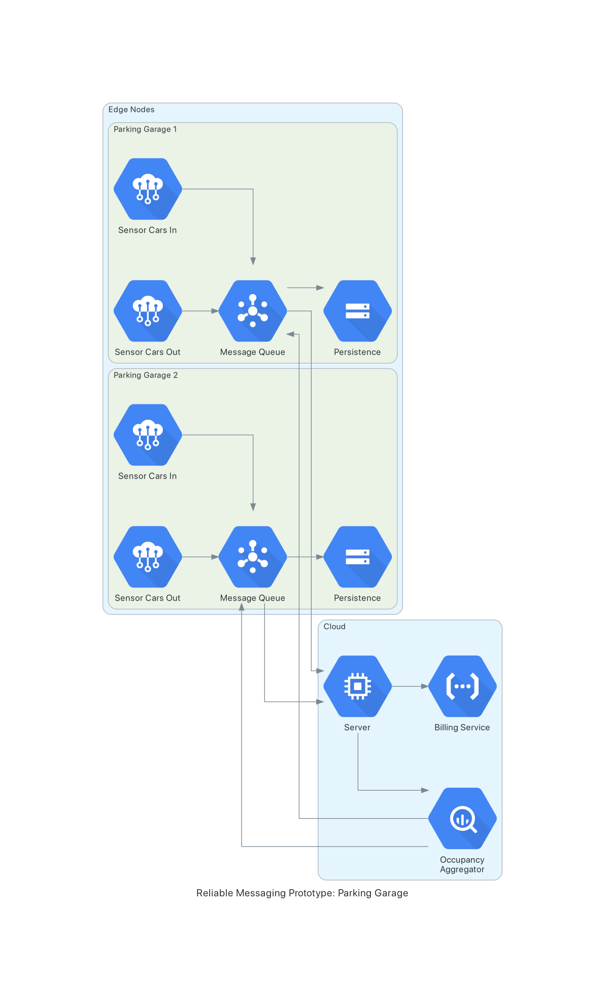

# Reliable Messaging for Fog Use Cases Prototype

## Set Up and Run

### Prerequisites
Python [Poetry](https://python-poetry.org/docs/) is used to manage dependencies.

### Set Up
`$ poetry install` installs all dependencies.

`$ poetry shell` activates the virtual environment.

### Run
The server can be started using `$ python app/start_server.py`.
(Make sure TCP on port 5555 is enabled.)

The edge nodes can be started using `$ python app/start_edge.py --garage_name 1`

## Use Case: Parking Garages (simulated)
We simulate a network of parking garages across a city that use a central server to a) aggregate occupancy data and b) handle billing.
There is an assumption that all cars using the parking garages are registered with their license plates.
Occupancy for all parking garages can be requested from the server and displayed at each parking garage.

Below there is a schematic overview of the system's architecture.

## Reliable Messaging
We operate on a client-server model. There can be multiple clients (a parking garage) that we calle edge nodes. They send data to a server (in the cloud). Data is processed and aggregated.
At regular intervals clients request updates on the aggregated data. 

Clients can fail or become unresponsive. The network does not guarantee order, timely delivery, or delivery at all.

We implement a reliable delivery mechanism based on the client-side [Lazy Pirate Pattern](https://zguide.zeromq.org/docs/chapter4/#Client-Side-Reliability-Lazy-Pirate-Pattern).
This means the client is responsible for delivery. It awaits an acknowledgement for every message sent.

If no ack is received the client may try to resend the message. Only an acknowledgement removes the message from the message queue.

This way, different types of messages can be sent via the same mechanism.
Generally, it is based on ZMQ's REQUEST-REPLY pattern, meaning every message exchange is to be initiated by the client. Clients can request data, the payload can be piggybacked on the acknowledgement.

### Algorithm
- client (edge node)
  - enqueue message (in background threads)
  - retrieve next message from queue (oldest first)
    - however, wait min. 2 seconds to resend a message
  - await ack
  - handle ack
    - dequeue message
    - process data (if applicable)

- server
  - receive message
  - handle message
  - send ACK
    - include requested data (if applicable)
